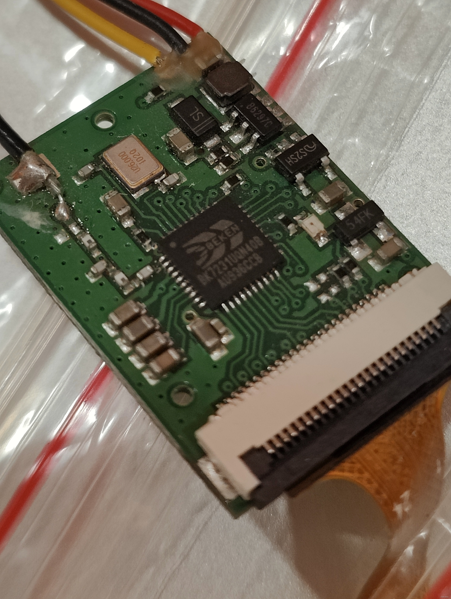
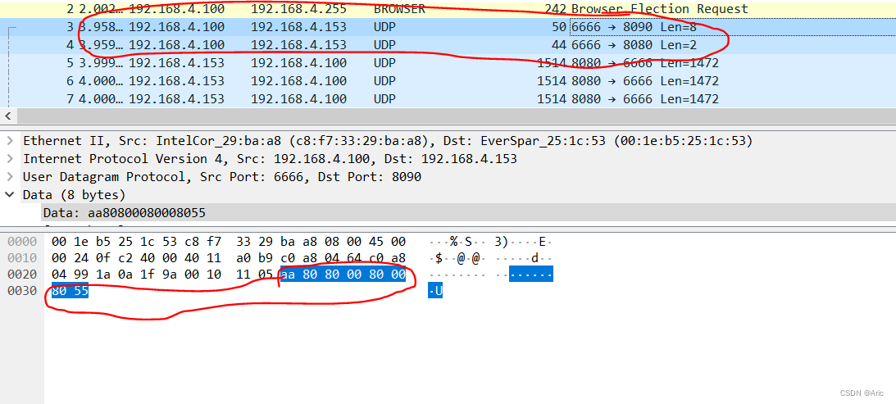
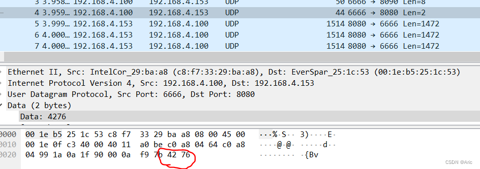
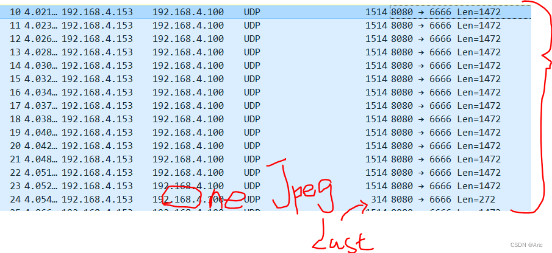
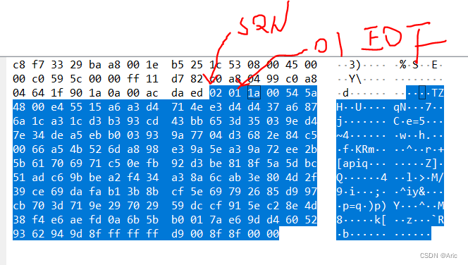
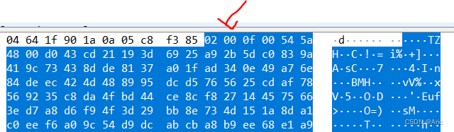

Here is a collection of drone drivers for the **HUAGE** brand drones model.

## Compatibility

- **HUAGE** drone model E88
- **HUAGE** drone model E99 (Not yet)

## How to use

Execute `./RUN.sh` and follow the instructions.

## Theory

I bought an image module of a mini drone on Xianyu, which introduced that I could use the wificam app to view real-time video and control. Because I want to use a computer to display, or develop my own APP to control and display real-time video, so I analyzed the reverse and recorded it here.

First of all, grasp the package analysis: prepare a computer with a dual wireless network card and install wireshark, one wireless network card set up the AP, and the other wireless network card connected to the FPV WIFI camera. Install the wificam app (apk) on the mobile phone, and connect the mobile phone to the hotspot built by the computer.

Let the computer turn on the routing function. At this time, open the wificam app and you can see the video. Use wireshark to grab a complete package, including, start, video transmission, and end. Through the analysis of the capture package, it can be seen that UDP 8090 is used for control, UDP 8080 is used to transmit video, probe out, and the video format is MJPEG VGA stream. The idea of using UDP shard transmission JPEG is quite good, and the effect is good. After all, it is a commercial solution.

Send AA 80 80 00 80 00 80 55 to 8090 and then send 42 76 to 8080º to start the video stream, both with UDP protocol. The stop is similar. First, send a command to UDP 8090, and then send 42 77 to UDP 8080 to stop the video.

MJPEG usually uses TCP stable transmission. The creativity of this project is UDP fragmented transmission, one frame at a time.

Grab the package and see the picture frame by frame. The last package becomes smaller, and it should be the transmission of the remaining data. UDP shading also has a boot header, including JPEG's renewal sequence number, 1-255 loop, which is represented by only one byte. The first second bit is used to represent the last fragment of the frame.

2 means the second picture, and 01 is the last piece of the piece. As you can see in the figure below, it is not the last piece, and the second digit is 0

UDP is likely to lose the package, so the tail also needs to be dealt with. I guessed a lot here, thinking it was bcc crc8 crc-sum and so on. It turned out that it was just a little endian's unsigned short. Then it's simple!